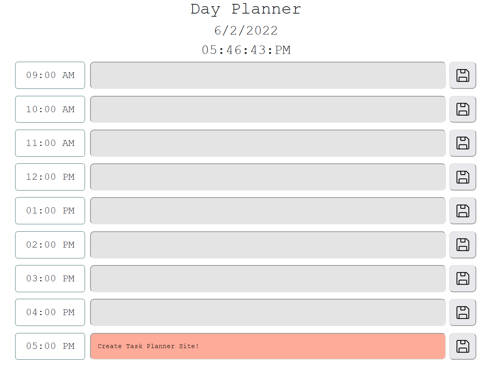

# DAY PLANNER
a basic day planner for me

## GOALS:
- [x] Use HTML, CSS, JS to create a basic day planner
- [x] Create local storage and load from it
- [x] Color code based on time
- [_] Switch to advanced version with improved JS

## VERSIONS:

#### BASIC VERSION: script_basic.js
- local storage with multiple key items

#### IDEAL VERSION: script_adv.js
- use JS to dynamically create items 
- better localstorage with objects 
  - I.E. -> key: [{time:event}, {time:event},...]
- Improve CSS

## CREATED WITH:
* [HTML]
* [CSS]
* [JS]
* [Bootstrap](https://getbootstrap.com)
* [JQuery](https://jquery.com)